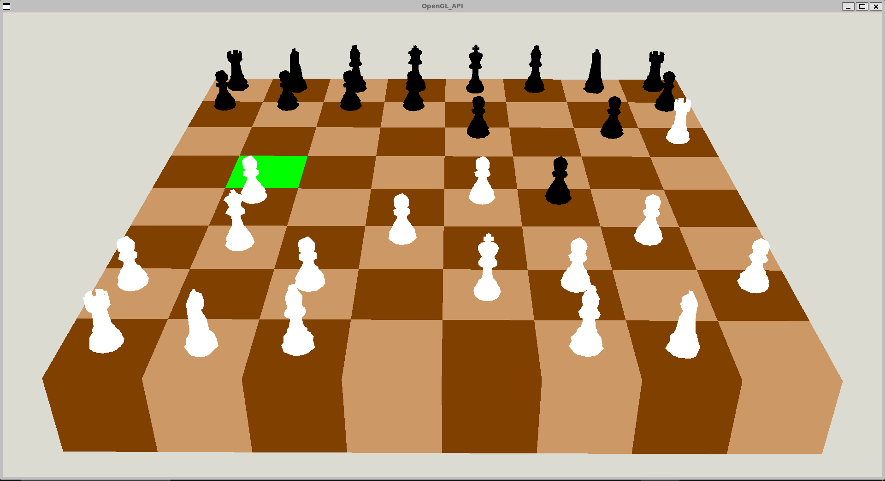

# 3D-chess ♟️  

a 3D chess game I coded with C++ and OpenGL


## Getting Started 🛠️ 
Before running the project, make sure you have the following dependencies installed on your system:
```bash
sudo apt-get install build-essential cmake libglew-dev libglfw3-dev libglm-dev libglu1-mesa-dev libgl-dev libxrandr-dev libxi-dev libxinerama-dev libx11-dev
```


