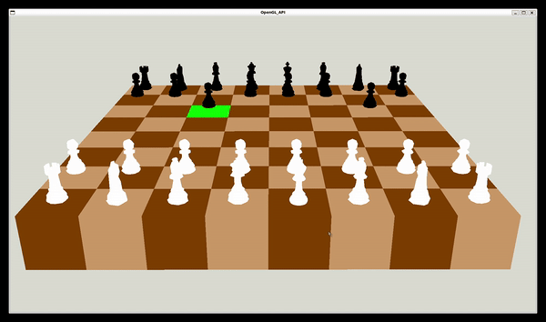

# 3D-chess ♟️  
Welcome to the 3D chess game project I coded using C++ and OpenGL! This project provides an interactive simulation to a chess game.


## Getting Started 💼
Before running the project, make sure you have the following dependencies installed on your system:
```bash
sudo apt-get install build-essential cmake libglew-dev libglfw3-dev libglm-dev libglu1-mesa-dev libgl-dev libxrandr-dev libxi-dev libxinerama-dev libx11-dev
```

### Building and Running the Project 🛠️
1. Clone the repository to your local machine and move to the project directory.
```bash
git clone https://github.com/hamza-rachidi/3D-chess.git
cd 3D-chess
```
2. build the project with Cmake and compile the project
```bash
mkdir build
cd build
cmake ..
make
```
3. Run the executable
```bash
./Chessgame
```

### Start the game 🕹️
This is a 3D modeled chess game where pieces move according to the rules of chess. Alternating between white and black pieces, each piece whose turn is chosen randomly moves to a random square in the chessboard grid while respecting its allowed movement. To make it easy to follow, a square of the chessboard turns green before it's occupied by a moving piece. The captured pieces disappear as well.

Should you navigate through the game for a better view angle, use the keyboard shortcuts : 
⬆️Zoom
⬇️Dezoom
➡️Move the chessboard to the right
⬅️Move the chessboard to the left
⬆ (Shift) and (Space) to control the chessboard view ( to see it from the above or bottom level )
🖱️ left click, hold and drag with your mouse to set the spatial position of the chessboard 

